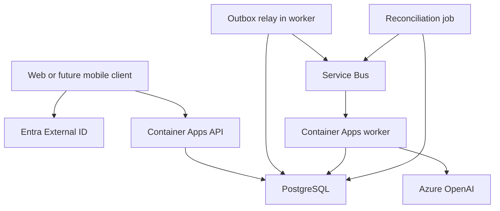

# PassIt — Azure Architecture

Status: proposed MVP architecture, not deployed. This document translates [PassIt.md](PassIt.md) into an Azure design; the conceptual entities are in [PassIt-Data.md](PassIt-Data.md). Monetization is separate in [PassIt-Monetization.md](PassIt-Monetization.md).

## Architecture Direction

Use a modular monolith with a shared domain layer, deployed as an HTTP API and a background worker. This keeps game rules and database transactions together while allowing AI processing and timeout handling to scale independently. Start with a responsive web client; the same API can support mobile clients later.

Proposed implementation: TypeScript/React web client, Python/FastAPI API, SQLAlchemy/Alembic persistence and a Python worker. These are technology proposals, not previously agreed product requirements.

| Responsibility | Proposed Azure service | Purpose |
| --- | --- | --- |
| Web client | Azure Static Web Apps | Host the static React application; backend remains a separate API. |
| API | Azure Container Apps | Public HTTPS endpoint, authorization and game commands. |
| Background worker | Azure Container Apps, without public ingress | Consume work queues, prepare turns, assign Motives and process timeouts. |
| Reconciliation | Scheduled Container Apps Job | Recover overdue turns and undispatched outbox work. |
| Database | Azure Database for PostgreSQL Flexible Server | Authoritative game state, settings, approvals, likes and temporary suggestions. |
| Messaging | Azure Service Bus | Durable asynchronous work and scheduled timeout messages. |
| LLM | Azure OpenAI deployment in Microsoft Foundry | Motive selection, turn suggestions and short titles. |
| Customer identity | Microsoft Entra External ID, external tenant | Registration and sign-in via OIDC; map identity to local User. |
| Container images | Azure Container Registry | Versioned API/worker images. |
| Secrets | Azure Key Vault | Store credentials that cannot use managed identity. |
| Telemetry | Azure Monitor / Application Insights | Structured logs, metrics and distributed traces. |
| Optional media | Azure Blob Storage | Add for avatars or exports when those features are implemented. |

Container Apps supports long-running applications and finite jobs; use a worker app for continuous queue consumption and a scheduled job for reconciliation [1, 2]. PostgreSQL is the relational authority [3]. External ID provides customer identity in a dedicated external tenant [5].

## Component Relationships

The API validates tokens and checks domain permissions. Clients do not access PostgreSQL, queues or LLM endpoints directly. Queue messages carry identifiers and event versions rather than full private stories. The worker loads authorized context from the database.

## Round & Turn Processing

1. **Launch:** validate group membership, random-selection opt-in, limits and settings. Snapshot participants in PostgreSQL. Start immediately without invitations; record durable preparation work in the same transaction.
2. **Prepare handoff:** read the completed story and remaining participants. Ask the LLM to select a valid Motive ID from the supplied catalog. Validate the result server-side; users cannot change it. Persist a random eligible recipient once so retries do not choose someone else.
3. **Assign turn:** atomically save participant, Motive, `assigned_at` and `deadline_at = assigned_at + turn_timeout_seconds`. Default timeout is 900 seconds. Enqueue preparation, notification and scheduled-timeout work through the outbox.
4. **Prepare suggestions:** generate and validate a baseline suggestion set and select one fallback from it. Store temporary turn data even when the user never opens the app. Preparation runs outside database locks; commit only if the turn is still eligible.
5. **Human submission:** verify identity, assigned participant, pending state and server deadline. Save contribution and AI flags, clear temporary suggestions, and enqueue the next handoff in one transaction.
6. **Timeout:** re-read the turn under a lock or conditional update. If still pending and due, save the exact prepared fallback with `ai_generated = true`, clear temporary data and enqueue the next handoff. A stale timeout for an already completed turn is a no-op.
7. **Completion:** end when no eligible participants remain. After the first successful pass, generate the title asynchronously and save it only if still absent.

The assignment timestamp remains the start of the timer; delayed AI preparation does not silently extend it. If suggestions are still unavailable at the deadline, close human submission, retry preparation and commit the prepared fallback when available. Expose a processing state and alert on persistent failures. Do not generate an unrelated continuation in the timeout handler.

The product currently describes submission and Pass separately. Proposed MVP simplification: a single **Submit & Pass** command commits the contribution and starts the durable next-handoff workflow. Confirm this product decision before implementation; a separate Pass action needs its own abandoned-handoff rule. The initiator/setup counting question is recorded in the data document.

## Reliable Deadlines & Delivery

Use Service Bus scheduled messages with the stored turn deadline as the enqueue time. Azure scheduling makes the message available at that time; worker execution can be later under load [4]. The database deadline controls acceptance of user input, not message arrival time.

Use a transactional outbox to avoid the database/queue dual-write gap. A worker relay dispatches events and marks them sent after broker acknowledgement. A crash between those actions can produce duplicates, so handlers must be idempotent. Keep at least one relay-capable worker instance active in production, or supply an independent polling trigger; undispatched database events cannot wake a worker through a queue that has not received them yet.

A scheduled reconciliation job, proposed every minute, scans indexed overdue turns and stale preparation/outbox records and re-enqueues missing work. Use bounded batches and locking to avoid concurrent duplication. Do not rely on in-memory timers or one sleeping process per turn.

Use separate queues for AI preparation and turn completion so slow LLM calls do not block deadline work. Apply bounded retries with backoff, dead-letter handling and operational alerts. Acknowledge messages only after durable state changes. No exactly-once delivery assumption is required.

## Publication & Access

Every active and unpublished Chain is accessible only to its participants. Check membership on every story, turn, suggestion and private-like endpoint. A saved group is only a launch shortcut; later edits do not change round access.

After completion, store one explicit approval per participant. In one transaction, verify that all members of the frozen participant set approved, then mark the Chain published. Missing approval never counts as consent, including for AI-completed turns. Discover queries filter for published completed Chains; do not expose private content through preview metadata or public caches.

Use short polling for the initial web experience, with the server deadline returned to the client. Notifications are convenience signals, not part of workflow correctness. Push delivery and live updates can be added later without changing game state semantics.

## Configurable LLM

Use a server-side LLM adapter that resolves an active, versioned admin configuration from PostgreSQL. The initial adapter targets Azure OpenAI. Endpoint, deployment, supported generation parameters, inference timeout, retry policy and prompt version are configurable without changing application code. Selecting an existing deployment is a configuration change; provisioning a new Azure deployment or adding a new provider remains infrastructure or implementation work.

Provide one creative default profile and optional task-specific profiles for Motives, suggestions, titles and setup assistance. Require an explicit guardrail profile in production; it may use a separate model. Store only credential references in configuration; retrieve secrets from Key Vault or use managed identity. Restrict editable endpoints to approved destinations and protect configuration actions with admin authorization.

Validate connectivity, model parameter compatibility and task response schemas before activating a revision, including harmless and abusive guardrail samples. Do not assume every model supports temperature or identical token parameters. Resolve and persist the creative profile revision when creating an AI work item, so retries use consistent settings. Creative changes affect new work. Guardrail changes recheck approved stories and regenerate unfinished suggestions under the current safety profile, preserving deadlines, assigned Motives and completed text.

Check each setup, rule and contribution before acceptance, generated text before delivery, and the complete story before publication. Every flagged human candidate blocks its actual author and creates an in-app notice. Withhold flagged AI output without banning its recipient. Retain server attribution and hashes for delivered AI text; client assistance flags are not evidence of origin. Quarantine existing flagged stories. Guardrail outages or malformed responses withhold content without banning accounts. Restrict evidence and review decisions to administrators; allow false positives, preserve independent manual blocks and recheck held stories before release. Administrator accounts remain protected from bans while their flagged text is withheld. Publication consent remains required.

This is application configuration, not a player preference or a Chain setting. Schema validation, deadline enforcement and publication permissions remain application-controlled regardless of model choice.

## AI Boundaries

Keep model deployment names and prompts configurable. Use schema-validated output for Motive IDs, suggestions and titles. Treat story text as untrusted content, separate it from system instructions, and reject invalid catalog IDs. Limit contribution length, total context and output size. Record latency, token usage and error codes, without routinely logging private stories or unused suggestions.

No agent framework, vector store or retrieval pipeline is needed for the initial bounded stories. All game decisions about membership, deadlines, turn order and publication are deterministic application rules; the LLM supplies creative content and Motives only.

## Deployment & Operations

Use separate development, staging and production resources. Provision with Bicep and deploy immutable container-image versions through CI/CD using federated credentials. Run schema migrations as a controlled job with backward-compatible changes before application rollout. Health checks and rollback use Container Apps revisions; do not run migrations independently in every API replica.

Use managed identities where supported, least-privilege roles, TLS and restricted database network access. Keep database credentials and service keys out of client code and source control. Choose the Container Apps networking configuration and private connectivity during infrastructure implementation; it is not implied merely by using these services.

Select a region only after checking service availability, model quota and residency requirements. Switzerland North is a candidate if those requirements can be met; it is not a promise that all AI processing stays in Switzerland. Azure model deployment types have different processing scopes [6]. Record the chosen model, deployment type and region before launch.

Enable database backups, define retention and practice restore. Production availability and recovery targets remain to be agreed; choose PostgreSQL high availability and API replica counts accordingly. Monitor API errors, queue age, overdue turns, fallback rate, AI preparation failures, outbox lag and publication errors.

Start with one region and no AKS cluster, Redis, separate search service or API gateway unless a measured need appears. Track database baseline cost, worker minimum replicas, messaging tier and AI tokens per round. Exact SKUs and budget need load and availability targets; this document does not claim a cost estimate.

## Validation Before Launch

Verify concurrent human submission versus timeout, duplicate queue deliveries, crashes between commit and dispatch, delayed suggestion preparation, recovery of overdue turns, and private-story authorization. Verify publication with one missing/rejected approval and with every participant approving. Check that completed temporary suggestions are cleared and are absent from application logs.

## Sources

Azure capabilities checked on 30 September 2026. Design choices above are proposals based on these capabilities.

1. [Azure Container Apps overview](https://learn.microsoft.com/en-us/azure/container-apps/overview)
2. [Jobs in Azure Container Apps](https://learn.microsoft.com/en-us/azure/container-apps/jobs)
3. [Azure Database for PostgreSQL Flexible Server](https://learn.microsoft.com/en-us/azure/postgresql/flexible-server/overview)
4. [Service Bus scheduled messages](https://learn.microsoft.com/en-us/azure/service-bus-messaging/message-sequencing)
5. [Microsoft Entra External ID for customers](https://learn.microsoft.com/en-us/entra/external-id/customers/overview-customers-ciam)
6. [Azure model deployment types](https://learn.microsoft.com/en-us/azure/foundry/foundry-models/concepts/deployment-types)
